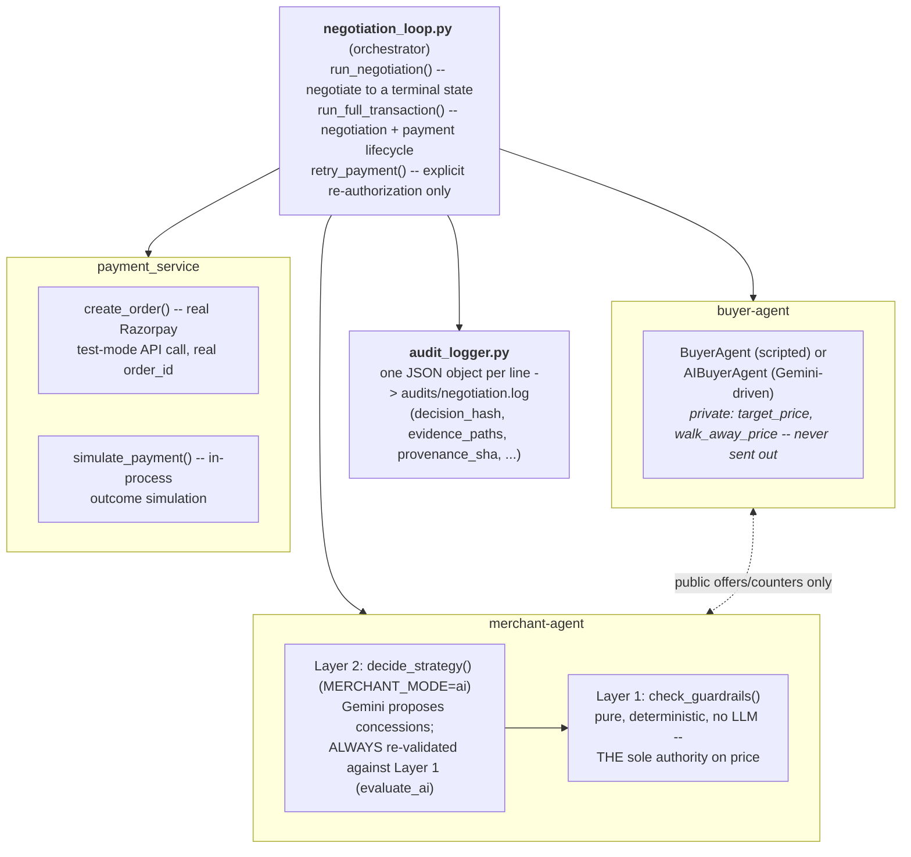

# Architecture

This document explains how Parley works, end to end, for a reader with no
prior context. It is synthesized from [`NEGOTIATION_SPEC.md`](NEGOTIATION_SPEC.md),
which remains the canonical, hand-maintained spec — section references
below (e.g. "Section 2J") point back to it for the full history and
reasoning behind any design decision. Where a design went through a real
bug or a real correction, this document says so explicitly, with the
actual numbers — that history is evidence the system has been tested
against live behavior, not just designed on paper.

---

## 1. Overview

Parley runs a real negotiation between two AI agents — a buyer-agent and
a merchant-agent — over a single product, and settles the agreed deal
through a real Razorpay test-mode payment. The AI decides *tactics*:
how aggressively to open, how fast to concede, how to frame a counter.
Deterministic, non-LLM code decides *boundaries*: the lowest price a
merchant will ever accept, whether a buyer looks risky, whether a
transaction needs a human's sign-off before money moves. No LLM output
ever reaches the buyer, the audit log, or a payment call without first
passing through code that would produce the same safe result even if
the LLM were replaced with something adversarial or broken.

---

## 2. Core components



- **Orchestrator — `negotiation_loop.py`**
  - `run_negotiation()` drives the buyer and merchant through rounds to
    one of a fixed set of terminal states (`AGREEMENT_RECORDED`,
    `REJECTED`, `ROUND_LIMIT_REACHED`, `BUYER_UNAVAILABLE`) — see
    Section 3 for the full state machine.
  - `run_full_transaction()` picks up from a negotiated agreement and
    carries it through the payment lifecycle (`PENDING_APPROVAL` →
    `PAYMENT_INITIATED` → `COMPLETED`/`ROLLBACK`, or
    `APPROVAL_DECLINED`) — Section 3A.
  - `retry_payment()` is the *only* path that ever retries a failed
    payment — never called automatically (Section 7).

- **Buyer-agent** — two interchangeable implementations behind the same
  interface (`initial_offer()`, `respond_to_counter()`):
  - `BuyerAgent` (scripted, Milestone 1) — deterministic, no network
    calls, used as the default for fast tests.
  - `AIBuyerAgent` (`BUYER_MODE=ai`) — one Gemini call per round
    (`gemini-3.5-flash-lite`), producing a structured decision that
    includes a **private** `target_price`, `walk_away_price`, and
    `strategy_note`.

- **Merchant-agent — two layers, always in this order:**
  - **Layer 1, `check_guardrails(offer, policy, round)`** — pure,
    deterministic, no LLM or network calls anywhere in it. This *is*
    the entire pricing authority: accept, counter, or reject, always
    citing the exact policy field that drove the decision.
  - **Layer 2, `decide_strategy(...)`** (`MERCHANT_MODE=ai`) — one
    Gemini call that decides *how* to negotiate (concede now vs. hold
    firm, how to frame the counter) inside whatever room Layer 1
    leaves. Its raw proposal never reaches the buyer directly:
    `evaluate_ai()` always calls Layer 1 first as ground truth, then
    validates Layer 2's proposal against it — a proposal that violates
    the guardrail is clamped to the nearest valid value, and the clamp
    (not the invalid raw value) is what gets recorded. On a Gemini
    outage, the merchant falls back to Layer 1's own verdict for that
    one round only, not a terminal failure.

- **Audit logger — `audit_logger.py`** — one JSON object per line,
  appended for every negotiation and payment action. Every agent
  (including the Risk Agent) calls the same `log_entry()` function; see
  Section 8.

- **Payment service — `payment_service.py`** — `create_order()` makes a
  real Razorpay test-mode API call; `simulate_payment()` decides the
  outcome in-process, since Razorpay's real capture step requires a
  browser Checkout flow this headless negotiation loop never performs
  (NEGOTIATION_SPEC.md Section 3A has the full rationale).

- **`personalization.py`** — a pure, deterministic data layer alongside
  all of this: turns a catalog product into the policy dict the
  guardrails read, and computes the LTV bonus, liquidation relaxation,
  risk assessment, and perk eligibility — all as bounded inputs *into*
  the same guardrail math, never as a parallel decision path.

**Neither agent ever sees the other's private reasoning.** The buyer's
`target_price`/`walk_away_price` exist only inside its own private
`buyer_strategy` audit entry (Section 4B) — never inside the `offer`
object the merchant evaluates. The merchant's exact floor price is
computed inside `check_guardrails()`/`_floor_price()` and is never sent
to the buyer as a number; the buyer only ever sees the merchant's public
counter-offer, exactly like a real negotiation between two parties who
each know their own limits and not the other's.

---

## 3. Buyer personas

Every buyer in `data/buyers.json` carries a `persona` label and a
free-text `negotiation_style` description. These aren't just flavor
text: each persona label deterministically maps to a discount-tolerance
band (`personalization.PERSONA_DISCOUNT_BANDS`) that bounds how far that
buyer's budget realistically sits below a product's real `list_price`
when it's derived at negotiation time (`budget_from_list_price()`) —
the AI/scripted buyer never gets a fixed absolute number unrelated to
what's actually being negotiated over.

| Persona | Discount band | Typical behavior |
|---|---|---|
| Premium Customer | 0–8% | Budget-insensitive; values convenience/quality over squeezing out a discount. |
| First Time Customer | 5–15% | Cautious, new to the merchant; pushes for a modest discount before trusting the deal. |
| Whale | 5–15% | Aggressive; anchors low and concedes very slowly, but has deep pockets. |
| Loyal Regular | 10–18% | Fair-minded, values the ongoing relationship; open to a reasonable discount, not confrontational. |
| Bulk Buyer | 12–24% | Quantity-focused; negotiates hard on volume discounts but is only mildly sensitive to per-unit price. |
| Stubborn Negotiator | 12–22% | Unyielding; slow to concede, holds firm round after round. |
| Occasional Buyer | 15–25% | Moderate; open to a fair discount but not desperate. |
| Bargain Hunter | 18–30% | Relentlessly price-focused; anchors low and pushes hard for the steepest discount. |
| Window Shopper | 25–40% | Passive; browses without urgency, rarely converts, quick to walk away rather than negotiate hard. Also the one persona denied every perk outright, regardless of order history — see Section 6. |

`negotiation_style` is a free-text field per individual buyer (fed
directly into the AI buyer's prompt) rather than a strict enum, so two
buyers sharing a persona label can carry slightly different exact
wording — the table above is the persona's typical shape across the
dataset, not a literal lookup string.

**"Whale" and "Occasional Buyer" don't appear in the frontend's buyer
dropdown** (Section 2Y) — their data and behavior are still fully live
(reachable via any direct `BUYER_ID` in a CLI run, and still affecting
`PERSONA_DISCOUNT_BANDS`/LTV math for any buyer who has one of these
labels), but the interactive frontend curates the list down to exactly
one hand-picked representative buyer per remaining persona, chosen by
matching real LTV/order-count numbers rather than "whoever came first
in the file."

---

## 4. The floor-price computation

Every negotiation has one number that governs everything: the floor
price the merchant will never counter below. It starts simple and gets
modified by three independent, composable inputs.

**Base floor:**

```
base_floor = max(absolute_margin_floor, discount_cap_floor)

absolute_margin_floor = policy.min_price
discount_cap_floor    = list_price * (1 - applicable_discount_pct / 100)
```

`applicable_discount_pct` comes from `policy.qty_breaks` if the buyer's
quantity meets a tier's `min_qty`, otherwise `policy.max_discount_pct`.
`min_price` itself is set at data-generation time to never go below
cost plus a minimum margin — a merchant never sells at a loss, by
construction.

**Then three inputs modify that base, each independently:**

1. **Liquidation** relaxes the *discount-cap floor* — not `min_price`
   itself — toward `min_price`, as inventory ages past its category's
   threshold (Electronics: 180 days; Books & Media: 380 days — slower
   categories get more slack, since long shelf time is normal for
   them). The relaxation ramps linearly over 100 days, reaching full
   relaxation (floor == `min_price`) at `threshold + 100` days, and
   never overshoots below `min_price`.

   *This wasn't the original design.* Liquidation originally relaxed
   `min_price` directly (Section 2E), but live-data analysis found that
   had **zero real effect** on 79 of 80 generated products — `min_price`
   already sat well below the discount-cap floor, so relaxing it never
   changed the actual `max()` result. Section 2J restructured it to
   relax the term that actually mattered.

2. **LTV loyalty bonus** raises `max_discount_pct` and every
   `qty_breaks` tier's rate *before* the floor is computed — a real
   buyer's cumulative order history (`sum` of `orders.json` amounts)
   maps to a bonus (0/2/5/8/12%, by LTV tier), always capped at a hard
   30% ceiling regardless of how loyal the buyer is.

3. **Risk tier** *tightens* the ceiling instead — the opposite
   direction from the LTV bonus. See Section 5 for the exact factors
   and percentages.

**When risk and liquidation both apply on the same product, risk's
restriction is what actually reaches the buyer for HIGH risk — it does
not get quietly relaxed away by liquidation.** This guarantee was not
free — it was the subject of a real bug and a real follow-up bug, both
caught by live reproduction with exact numbers:

> **The bug (Section 2T):** on `SKU-ELEC-003` (`list_price=7976.05`,
> `min_price=5093.53`, fully past its liquidation ramp), a HIGH-risk
> negotiation correctly *displayed* "Discount ceiling: 0% — full list
> price only," but the merchant's actual counter and the buyer's final
> price settled at **5093.53**, not 7976.05 — a ~2882 INR discount a
> HIGH-risk buyer explicitly should never have received. The root
> cause: liquidation's relaxation ran *after* risk had already
> tightened the discount-cap floor, and on a fully-ramped product it
> interpolated straight past the risk restriction to `min_price`,
> silently erasing it. Two individually-correct rules had never been
> reconciled for their *combination*.
>
> **The fix:** the risk-tightened discount-cap floor is snapshotted as
> a third floor candidate *before* liquidation ever touches it, and the
> real floor becomes `max(min_price, liquidation-relaxed discount floor,
> pre-liquidation risk ceiling)` — one extra term in the same `max()`
> every other rule already flows through. Post-fix, the same product
> settles at exactly **7976.05** (list price) under HIGH risk.
>
> **The follow-up bug (Section 2V):** the first fix's condition was
> "is risk active at all," which also caught MODERATE risk — so
> liquidation got suppressed for MODERATE too, even though MODERATE is
> only supposed to be a *tighter starting point* that liquidation
> should still relax through normally (unlike HIGH, which is a hard
> override). Narrowed the condition to "risk level is specifically
> HIGH," restoring MODERATE's correct behavior: on the same product,
> MODERATE now correctly lands back at `min_price` (5093.53) — same as
> NONE risk — because liquidation is fully ramped on this particular
> product, while a partially-ramped product would show MODERATE landing
> above NONE's floor, as intended.

The net rule: **HIGH risk's ceiling always wins over liquidation.
MODERATE risk only sets a tighter starting point that liquidation
continues to relax normally, exactly as it would for an unrestricted
policy.**

---

## 5. The Risk Agent

Deterministic, code-only — no LLM call anywhere in this feature
(`personalization.risk_assessment()`). It runs once, before the buyer's
first offer is even generated, from two independent factors that are
both knowable before any offer exists:

| Factor | Threshold |
|---|---|
| `new_buyer` | Fewer than 2 prior orders on file for this buyer |
| `large_request` | Requested quantity ≥ the product's lowest `qty_breaks` tier (10, in the generated catalog) |

| Tier | Condition | Discount ceiling | Approval requirement |
|---|---|---|---|
| **NONE** | Neither factor | Untouched — full normal room | Not forced |
| **MODERATE** | Exactly one factor | `max_discount_pct` alone scaled to 25% of normal (`qty_breaks` tiers untouched) | Not forced by default — **unless** the merchant's `risk_approval_tier` is `"strict"` |
| **HIGH** | Both factors | `max_discount_pct` **and** every `qty_breaks` tier scaled to 0% — full list price, no negotiation room | Always forced, regardless of merchant tier or transaction size |

Worked example (`SKU-ELEC-007`, `list_price=1918.96`, 13% base discount,
qty=3 — no `qty_breaks` tier applies at this qty):

| Risk tier | Effective ceiling | Floor |
|---|---|---|
| NONE | 13% | 1669.50 |
| MODERATE | 3.25% (13 × 0.25) | 1856.59 |
| HIGH | 0% | 1918.96 (= list price) |

A strict `NONE < MODERATE < HIGH` ordering, live-verified exactly.

**Why MODERATE only scales `max_discount_pct`, not `qty_breaks`:** an
earlier version scaled both, exactly like HIGH — but that made an
ordinary repeat buyer's *legitimate bulk order* more expensive, not
less: crossing a qty_breaks threshold (e.g. 9 → 10 units) trips
`large_request` on its own, and scaling an 18%-off tier down to 4.5% is
worse than the unscaled 12% base rate that applied one unit below the
threshold (Section 2W — a real regression the user reproduced with
exact numbers: floor rose from 8694.28 to 9435.27 for ordering one more
unit). Fixed by only scaling `qty_breaks` tiers for HIGH — the
genuinely new-buyer-*and*-bulk combination that's meant to be a
circuit breaker — leaving MODERATE-from-bulk-alone free to still get
its real bulk discount.

**Per-merchant `risk_approval_tier`** (Section 2R) changes only
MODERATE's approval behavior — it never touches pricing, and HIGH's
forced approval is identical regardless of merchant. `"strict"`
merchants (Voltstream Marketplace) force human approval on MODERATE
risk too; `"standard"` merchants (Hearth & Home Living) don't. The
`risk_assessment()` function itself has zero concept of "merchant" —
only the approval-gate condition in `run_full_transaction()` widens per
merchant, so the same buyer against the same product-economics settles
at the identical price against either merchant; only the gate differs.

---

## 6. Perks

Buyers can request `free_delivery` and `extended_warranty` alongside
price. Eligibility is fully deterministic
(`personalization.perk_eligibility()`), checked once per negotiation,
before any offer is generated:

| Rule | Condition | Result |
|---|---|---|
| 1 | `risk_level == "high"` | No perks at all — overrides everything below |
| 2 | Persona is "Window Shopper" | No perks at all, regardless of order history |
| 3 | Buyer has 0 prior orders | Eligible for `free_delivery` |
| 4 | Requested quantity > 10 | **Also** eligible for `free_delivery` — independent of rule 3 |
| 5 | Buyer has > 0 prior orders | Eligible for `extended_warranty` |

Rules 4 and 5 can both fire for the same buyer — an established buyer
(rule 5) placing a bulk order (rule 4) is eligible for **both** perks at
once (Section 2AH deliberately broke the earlier "at most one perk"
assumption).

**Granted perks are checked against the exact same margin floor as
price, not a separate check.** A perk has a real cost to the merchant
(`shipping_cost`/`warranty_cost`, per-category or cost-derived), and
`_floor_price(policy, qty, granted_perk_cost)` folds that cost directly
into the same floor formula: `floor = max(existing_floor, min_price +
granted_perk_cost)`. If the negotiated price still clears that
augmented floor, the perk is granted; otherwise every requested perk is
declined (all-or-nothing, since a buyer is eligible for at most one
perk *type* per rule anyway). Live-verified example: a buyer negotiated
down to exactly the (non-perk) floor of 800.0, eligible for
`extended_warranty` (cost 40.0) — the merchant accepted the *price* but
declined the *perk*, since granting it would have breached margin:
`granted_perks: []`, `declined_perks: ["extended_warranty"]`, with the
margin floor named explicitly in the rationale.

---

## 7. Failure modes and rollback

Two distinct ways a negotiated agreement can fail to become a real
sale — both roll back cleanly, with no duplicate payment attempts and
no falsely-decremented inventory.

**1. Payment failure.** A real Razorpay test-mode order is created
(`create_order()`), but the simulated outcome (`simulate_payment()`) is
a failure. `_attempt_payment()` makes **exactly one**
`create_order()` call per invocation and never loops or calls itself —
"never automatically retried" is true by construction, not convention.
On failure: the simulated inventory hold is released
(`inventory_release`), the buyer-agent's side is recorded
(`buyer_notification`), and the operator is notified
(`human_notification`) — all logged together in the same code path that
produces the rollback, so none of these can happen without the others.
The **only** way to retry is an explicit, separate `retry_payment()`
call — never invoked automatically — bounded by the original offer's
own expiration window (5 minutes); past that, retry is refused outright
rather than resurrecting a stale offer.

**2. Insufficient inventory.** Only active on the catalog-driven
(`PRODUCT_ID`) path. Checked *before* the inventory hold, before the
approval gate, and before any Razorpay call at all: if the negotiated
quantity exceeds the product's real `current_inventory`, the outcome
rolls back immediately with `reason: "insufficient_inventory"` and
`payment_service` is **never called** — this is a different, earlier
check than a payment failure, not a variant of it. Inventory is only
ever decremented once, at the one point a sale is genuinely
`COMPLETED` (real payment success) — never on a rollback of either
kind, so a failed or declined negotiation can never falsely reduce
stock.

Both rollback variants carry a distinguishing `reason` key
(`"payment_failure"` vs. `"insufficient_inventory"`) on the outcome, so
a caller can tell which failure occurred without re-deriving it from
the audit log.

---

## 8. The audit trail

Every negotiation and payment action is written as one JSON object per
line to `audits/negotiation.log`. Every entry carries:

| Field | Purpose |
|---|---|
| `decision_id` | Unique id for this specific entry |
| `negotiation_id` | Groups every entry (negotiation *and* payment phase) produced by one run — generated once, threaded through everything |
| `agent` | `"buyer-agent"`, `"merchant-agent"`, or `"risk-agent"` |
| `action` | e.g. `"offer"`, `"counter"`, `"accept"`, `"reject"`, `"payment_completed"`, `"risk_review"` |
| `rationale` | 1–2 sentences naming the exact reasoning |
| `evidence_paths` | Dotted paths into the policy object naming exactly which field drove the decision |
| `decision_hash` | sha256 of the canonical (sorted-key) JSON of `{offer, rationale, evidence_paths, ...}` — independently recomputable from the entry's own fields |

**Why `evidence_paths` matters:** it turns "the merchant rejected this
offer" into "the merchant rejected this offer because the price was
below `policy.min_price` (3799.0)" — a judge (or an auditor) can trace
every dollar figure in the system back to the exact policy field that
produced it, without having to trust free-text rationale alone.

This attribution was itself the subject of a real fix (Section 2I): a
liquidation-relaxed `min_price` became counter-able rather than an
instant reject (Section 2F), which meant `min_price` could now
legitimately be the *winning* term in the floor's `max()` calculation —
but `_floor_price()` always cited the discount-tier path regardless of
which term actually won. Fixed to compare both candidates directly and
cite whichever one is actually binding — a pure audit-attribution fix,
the clamped price itself was never wrong.

`decision_hash` deliberately excludes `negotiation_id`/`timestamp`/
`decision_id` — it hashes only the *content* of the decision (offer,
rationale, evidence, and payment/clamp details when present), so the
same decision made twice would hash identically; the surrounding
identity fields describe *which run* produced the entry, not *what was
decided*.

---

## 9. Multi-merchant support

Two full merchant profiles (`data/merchants.json`), each owning a whole
slice of the catalog by category:

| | MERCH-001 — Voltstream Marketplace | MERCH-002 — Hearth & Home Living |
|---|---|---|
| Categories | Electronics, Office & Stationery, Toys & Games, Sporting Goods & Outdoors | Apparel & Fashion, Home & Kitchen, Books & Media, Beauty & Personal Care |
| Products | 40 | 40 |
| `risk_approval_tier` | `strict` | `standard` |

`risk_approval_tier` is the one field that actually changes behavior
today (the profile also carries `business_description`,
`supported_payment_methods`, `shipping_rules`, `return_policy` —
real, displayed data not yet wired into any guardrail). **Zero new
negotiation logic was needed** — `risk_assessment()` has no concept of
"merchant" at all; only the approval-gate condition in
`run_full_transaction()` was widened to also check the merchant's tier.
Live-verified with the identical buyer and product economics against
both merchants: `BUYER-001` (0 prior orders, the sole MODERATE-
triggering factor) forces the human-approval gate against MERCH-001,
and does **not** against MERCH-002 — same buyer, same risk factor, same
settled price, only the gate differs, because only the merchant
differs.

(Worth noting as evidence this was genuinely tested against live
behavior, not just designed: MERCH-001 was originally named "Voltstream
Electronics," which the user twice reported as a product-filtering bug.
Direct investigation confirmed the filter was correct — the merchant
genuinely, deliberately carries a 4-category catalog; the *name* just
overpromised a single category. Fixed by renaming to "Voltstream
Marketplace" and correcting both merchants' descriptions to name every
category they actually carry — Section 2AA.)

---

## 10. Frontend / API layer

**`src/api.py`** is a FastAPI wrapper around the exact same core
functions described above — `POST /api/negotiate` and
`POST /api/approve` call `run_negotiation()`/`run_full_transaction()`
directly. There is no separate negotiation logic in the API layer; the
CLI (`python -m src.negotiation_loop`) and the web frontend drive the
identical engine.

**Pause/resume for human decisions.** Two situations pause a
negotiation mid-flight, both using the same `PAUSE_FOR_APPROVAL`
sentinel under the hood but kept in **separate** pending-decision stores
(`_PENDING_APPROVALS`, `_PENDING_ROUND_LIMIT`) — deliberately not
merged, since the two pauses can chain (a round-limit acceptance can
itself trigger a normal approval gate) and conflating them would make
it ambiguous which decision a given negotiation is actually waiting on:

- **Human approval** (`POST /api/approve`) — fires when the transaction
  value exceeds `transaction_approval_threshold`, or risk/merchant-tier
  conditions require it (Section 5).
- **Round-limit decision** (`POST /api/round-limit-decision`) — fires
  when `max_negotiation_rounds` is reached with no agreement; the
  merchant's last real counter-offer is presented, and a human (or the
  buyer) explicitly accepts or declines it — never auto-decided.

**Live dashboards, not static snapshots.** `dashboard.html` and
`frontend/inventory.html` both fetch live from the API
(`GET /api/dashboard-data`, `GET /api/inventory`) rather than reading a
pre-baked file. The dashboard's computation (`src/dashboard.py`) is a
single shared function called by both the live API endpoint and the
offline `scripts/generate_dashboard.py` fallback — one aggregation
implementation, two consumers, never two copies of the same logic that
could quietly drift apart.

**The negotiation UI** (`frontend/negotiate.html`) is a single page with
a three-step, JS-controlled flow: setup → negotiation-in-progress
(round-by-round reveal, plus both pause cards when they fire) →
outcome (settled price, floor-price breakdown, payment details, granted/
declined perks, and a raw, unformatted audit-trail dump for anyone who
wants to verify the curated view against the real log entries).

---

## 11. Known, deliberate scope decisions

These are intentional choices for a time-boxed competition build, not
unfinished work — each one is a natural next step with a clear path,
not a gap papered over.

- **Single-process, not networked agents.** The buyer-agent and
  merchant-agent are Python objects called in-process by one
  orchestrator, not separate services exchanging messages over a
  network. The negotiation protocol (structured offers, rationale,
  evidence paths) is already shaped so it could cross a real wire later
  without changing any decision logic — the natural next step is
  wrapping each agent behind an RPC boundary, not redesigning how they
  decide anything.

- **JSON files, not a database.** `data/catalog.json`, `data/buyers.json`,
  `data/orders.json`, and the `audits/` log are flat files. This keeps
  the audit trail trivially inspectable (`grep`, a JSONL viewer, a
  one-line Python script) at the cost of concurrent-write safety and a
  query layer — the right tradeoff for a single-operator demo. The next
  step is a straightforward swap to a real datastore behind the same
  `load_json()`/`log_entry()` seams, which already isolate every file
  read/write to one place each.

- **The Risk Agent is deterministic, not ML-based.** Two knowable-in-
  advance factors (new buyer, large request) feed the same "bounded
  input into existing guardrails" pattern already used for LTV and
  liquidation — explainable by construction, no training data needed
  for a demo. The natural next step is replacing `risk_assessment()`
  with a trained classifier that still returns the same
  `{level, discount_factor, evidence_paths}` shape — every downstream
  consumer (the floor calculation, the approval gate, the audit
  rationale) would need zero changes, since none of them know or care
  whether the assessment came from rules or a model.

- **No minimum-order-quantity logic beyond a simple floor.**
  `inventory_floor` rejects an offer below a minimum quantity; there's
  no real stock reservation, backorder, or MOQ-as-a-negotiated-term
  concept. The perks mechanism (Section 6) already demonstrates the
  pattern a real MOQ feature would reuse — a new eligibility/cost
  dimension resolved once and folded into the same margin-floor
  check — so this is a scoped extension of an existing pattern, not new
  architecture.
